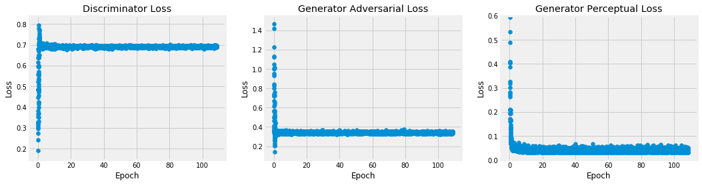

# Trained models

## CVAE

We train the CVAE by first increasing the minibatch size from 4 to 24 while keeping the learning rate fixed at 0.001 and then decrease the learning rate to 1e-6 in powers of 0.1. 
The ELBO on the training set starts to diverge from that on the test set after about 100k samples, corresponding to about a third of all samples in the training set. 
The samples are not independent however, since they are formed by combinations of two tiles, as described in Sec. 2.2 in the paper. 
The number of independent samples that can therefore be formed from the 11 slices, 16 tiles, and 11 redshifts is 1936. 
The expected number of samples required to visit those independent samples is approximately n log n = 14652, such that seeing signs of overfitting before the whole training set has been processed is not unexpected.
We stop the training after 150k samples, which corresponds to a training time of about 3 hours on a single Nvidia GTX 1080 Ti.

### Recognition network

The recognition network `q(z|x,y)` takes as input
* x, the pressure tile (shape (N,1,512,512))
* y, the dark matter tile and its redshift (shape (N,2,512,512))

Part A of the network processes x, Part B processes y. The output of the two get concatenated and fed through Part C. The output are the mean and log variance of the latent variable z (shape (N,1,16,16) for both).

#### Part A

| Layer    | Channel (in/out) | Kernel | Stride | Bias | BatchNorm | Activation |
|----------|------------------|--------|--------|------|-----------|------------|
|Conv      |1/8               |4       |2       |F     |T          | ReLU       |
|Conv      |8/16              |8       |4       |F     |T          | ReLU       |
|Conv      |16/32             |8       |4       |F     |T          | ReLU       |

#### Part B

| Layer    | Channel (in/out) | Kernel | Stride | Bias | BatchNorm | Activation |
|----------|------------------|--------|--------|------|-----------|------------|
|Conv      |2/8               |4       |2       |F     |T          | ReLU       |
|Conv      |8/16              |8       |4       |F     |T          | ReLU       |
|Conv      |16/32             |8       |4       |F     |T          | ReLU       |

#### Part C

| Layer    | Channel (in/out) | Kernel | Stride | Bias | BatchNorm | Activation |
|----------|------------------|--------|--------|------|-----------|------------|
|Conv      |64/2              |5       |1       |F     |T          | ReLU       |

### Prior network

The prior network `p(z|y)` takes as input
* y, the dark matter tile and its redshift (shape (N,2,512,512))

The output are the mean and log variance of the latent variable z (shape (N,1,16,16) for both). The architecture is basically Part B and Part C from the recognition network.

| Layer    | Channel (in/out) | Kernel | Stride | Bias | BatchNorm | Activation |
|----------|------------------|--------|--------|------|-----------|------------|
|Conv      |2/8               |4       |2       |F     |T          | ReLU       |
|Conv      |8/16              |8       |4       |F     |T          | ReLU       |
|Conv      |16/32             |8       |4       |F     |T          | ReLU       |
|Conv      |32/2              |5       |1       |F     |T          | ReLU       |

### Generator network

The generator network `p(x|y,z)` takes as input
* y, the dark matter tile and its redshift (shape (N,2,512,512))
* z, the latent variable (shape (N,1,16,16))

The latent variable is passed to Part A of the network. The output of Part A is concatenated with y and passed through Part B. The output of Part B is the mean of the predidicted pressure tile with shape (N,1,512,512).

#### Part A

| Layer    | Channel (in/out) | Kernel | Stride | Bias | BatchNorm | Activation |
|----------|------------------|--------|--------|------|-----------|------------|
|Conv      |1/1               |4       |2       |F     |T          | ReLU       |
|Conv      |1/1               |8       |4       |F     |T          | ReLU       |
|Conv      |1/1               |8       |4       |F     |T          | ReLU       |

#### Part B

| Layer    | Channel (in/out) | Kernel | Stride | Bias | BatchNorm | Activation |
|----------|------------------|--------|--------|------|-----------|------------|
|Conv      |3/16              |5       |1       |F     |T          | ReLU       |
|Conv      |16/32             |4       |2       |F     |T          | ReLU       |
|Conv      |32/64             |4       |2       |F     |T          | ReLU       |
|Conv      |64/128            |4       |2       |F     |T          | ReLU       |
|ResBlock x 4 |               |        |        |      |           | ReLU       |
|ConvTransp|128/64            |4       |2       |F     |T          | ReLU       |
|ConvTransp|64/32             |4       |2       |F     |T          | ReLU       |
|ConvTransp|32/16             |4       |2       |F     |T          | ReLU       |
|ConvTransp|16/8              |7       |1       |F     |F          | PReLU      |
|ConvTransp|8/1               |5       |1       |F     |F          | PReLU      |
|ConvTransp|1/1               |3       |1       |F     |F          | Softplus   |

#### Residual block

| Layer    | Channel (in/out) | Kernel | Stride | Bias | BatchNorm | Activation |
|----------|------------------|--------|--------|------|-----------|------------|
|Conv      |128/128           |3       |1       |F     |T          | ReLU       |
|Conv      |128/128           |3       |1       |F     |T          |            |

## CGAN

We train the CGAN with parameters as described in the [Hyperparamters section](#hyperparameters). The learning rate is decayed by a percentage factor every 1568 generator and discriminator iterations.

The redshift feature map attached to each sample ~y from the dark matter density distribution is transformed with the function f (z) = z − 1 to balance the feature around 0 as the domain of z is [0, 2].

Discriminator and generator structures are adapted from Johnson, Alahi, and Fei-Fei, 2016 ([arXiv:1603.08155](https://arxiv.org/abs/1603.08155)). Every layer is spectrally normalised (Miyato et al., 2018, [arXiv:1802.05957](https://arxiv.org/abs/1802.05957)). 
All layers except for the last layer are initialised with the Kaiming scheme (He et al., 2015, [arXiv:1502.01852](https://arxiv.org/abs/1502.01852)). The last layer is initialised with Xavier(gain=0.25) (Glorot and Bengio, 2010, [arXiv:1406.2661](https://arxiv.org/abs/1406.2661)).

We stop the training after 125k-150k samples, which corresponds to a training time of about 6 hours on a single Nvidia GTX 1060 TI.

### Discriminator

| Layer | Channel (in/out) | Kernel | Stride | Bias | BatchNorm | Activation     |
|-------|------------------|--------|--------|------|-----------|----------------|
| Conv  | 3    / 64        | (4, 4) | (2, 2) | T    | F         | LeakyReLU(0.2) |
| Conv  | 64   / 128       | (4, 4) | (2, 2) | F    | F         | LeakyReLU(0.2) |
| Conv  | 128  / 256       | (4, 4) | (2, 2) | F    | F         | LeakyReLU(0.2) |
| Conv  | 256  / 512       | (4, 4) | (1, 1) | F    | F         | LeakyReLU(0.2) |
| Conv  | 512  / 1         | (4, 4) | (1, 1) | T    | F         | Sigmoid        |

### Generator

| Layer         | Channel (in/out) | Kernel | Stride | Bias | BatchNorm | Activation     |
|---------------|------------------|--------|--------|------|-----------|----------------|
| Conv          | 2   / 32         | (9, 9) | (1, 1) | F    | T         | LeakyReLU(0.2) |
| Conv          | 32  / 64         | (3, 3) | (2, 2) | T    | T         | LeakyReLU(0.2) |
| Conv          | 64  / 128        | (3, 3) | (2, 2) | T    | T         | LeakyReLU(0.2) |
| ResBlock x 9  |                  |        |        |      |           |                |
| ConvTranspose | 128  / 64        | (3, 3) | (2, 2) | T    | T         | LeakyReLU(0.2) |
| ConvTranspose | 64   / 32        | (3, 3) | (2, 2) | T    | T         | LeakyReLU(0.2) |
| Conv          | 32   / 1         | (9, 9) | (1, 1) | T    | T         | TanH           |

The residual blocks have the same structure as in the CVAE (see the [Residual block section](#residual-block)) but use a `LeakyReLU(0.2)` activation instead of a `ReLU` activation.

### Hyperparameters

| Parameter               |        Value |
|-------------------------|--------------|
| lambda perceptual       |          2.5 |
| learning rate           |         5e-5 |
| Adam betas              | (0.5, 0.999) |
| learning rate decay     |         0.85 |
| samples                 |    125k-150k |
| training batch size     |     6        |

### Losses
We parametrise the training schedules in 'pseudo' epochs of 1568 samples. This corresponds roughly to the number of fully independent samples in the training set and makes for a more useful measure than the full training set of 340'736 (dependent) samples.

